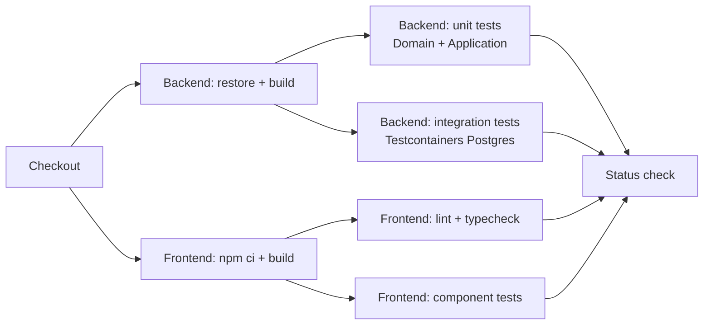
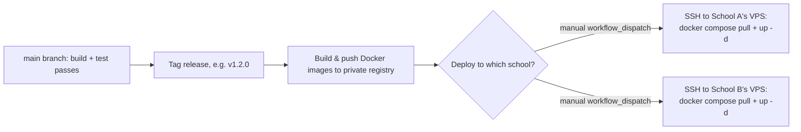

# CI/CD

GitHub Actions, kept deliberately simple: one pipeline that validates every PR, and a manually-triggered (not automatic) deploy step per school — because "deploy" here means "deploy to one specific client's production VPS," which should never happen silently on a merge.

## CI — runs on every PR and push to `main`

**Stages, and why each is where it is:**
1. **Build (backend + frontend in parallel)** — fail fast on compile errors before spending time on tests.
2. **Unit tests (Domain + Application)** — fast, no external dependencies; run on every push, including drafts.
3. **Integration tests (Testcontainers)** — slower (spins up real Postgres in the CI runner); still on every PR, since this is where wiring bugs (Rule #11's "lighter touch but real") are caught.
4. **Frontend lint/typecheck/component tests** — run in parallel with backend tests, not blocking on them.
5. **E2E (Playwright)** — deliberately **not** on every PR (per `TESTING_STRATEGY.md`, kept fast); runs on merge to `main` and before tagging a release, to keep PR feedback loops short.

**Branch protection:** `main` requires the CI status check to pass and one review before merge — standard, no further ceremony (no required multi-approver rules, no mandatory design-doc sign-off) given the team size.

## CD — deploy is a deliberate, per-school action

There is no single "production" environment to continuously deploy to — there are as many production environments as there are schools, each on its own VPS, each potentially on a different template version. Continuous *deployment* (auto-deploy on merge) is therefore the wrong model; this project uses continuous *delivery* with an explicit trigger per school.

- **Image build:** on tagging a release in the template repo (or in a specific school's repo, if that school has diverged), GitHub Actions builds the `api` image and pushes it to a private container registry (e.g. GitHub Container Registry), tagged with the version.
- **Deploy trigger:** a `workflow_dispatch` (manually triggered) GitHub Actions job, parameterized by which school/VPS to target, that SSHs in and runs `docker compose pull && docker compose up -d` for that school only. This keeps the "who deployed what, to which school, when" decision visible and intentional — matching the "each school evolves independently" principle, and avoiding an accidental simultaneous rollout to a client who wasn't scheduled for an update.
- **Migrations:** applied automatically on `api` container startup (see `DEPLOYMENT_ARCHITECTURE.md`), so the deploy step itself stays a simple pull + restart.

## Secrets

- Registry credentials and each school's VPS SSH key are stored as GitHub Actions encrypted secrets, scoped per-repository (the template repo doesn't hold any individual school's deploy secrets; each school's own repo — or a restricted deploy-only repo — holds only that school's credentials). This mirrors the "nothing shared at runtime" principle into the deployment tooling itself: a leaked credential in one school's CI config cannot reach another school's server.

## What's explicitly out of scope

- No auto-deploy on merge to `main` — deliberately manual per school, as above.
- No staging environment shared across schools — if a school wants a staging/UAT environment before going live, it's a second, smaller VPS provisioned the same way as production for that school specifically, not a shared multi-tenant staging system.
- No feature flags / progressive rollout system — unnecessary at single-school-VPS scale; a bad release is rolled back by redeploying the previous image tag.
