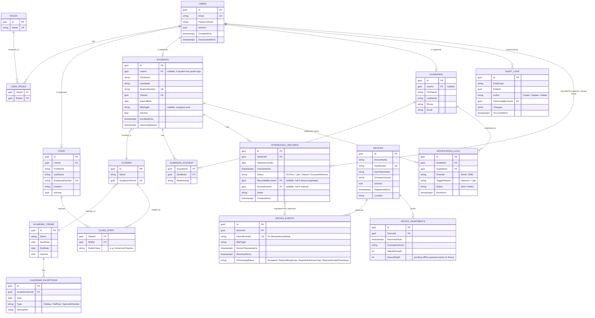

# Database Design

PostgreSQL, one database per school (per the independent-deployment model). Schema shown here is the V1 baseline — every table exists in every school's database; per-school *values* differ, not structure (Rule #2 in `RULES.md`).

## Design principles

- **Soft delete over hard delete** for anything referenced by historical records (Students, Staff, Devices) — attendance history must remain meaningful even after a student leaves. A `IsActive` / `DeactivatedAtUtc` column, not a physical `DELETE`.
- **UTC everywhere in storage.** `SchoolSettings.Timezone` is used only for display/formatting at the edges (API responses, UI), never for stored timestamps.
- **Audit trail as a cross-cutting interceptor**, not a bespoke table per entity — one `AuditLogs` table capturing entity type, entity id, action, changed-by, timestamp, and a JSON diff.
- **No multi-tenancy columns.** There is no `SchoolId` / `TenantId` column anywhere — one school, one database. Adding one would be solving a problem this model doesn't have (and would violate Rule #2's spirit at the schema level).

## Entity Relationship Diagram

## Notes on key design decisions

**`DEVICE_EVENTS` is a separate table from `ATTENDANCE_RECORDS`.** A device event is a raw, untrusted signal; an attendance record is the Attendance Engine's *decision* after applying business rules (lateness threshold, calendar exceptions, duplicate debounce). Keeping them separate means:
- A rejected/duplicate scan is still logged (useful for debugging device issues) without polluting attendance history.
- The Attendance Engine's rules can change and be *reapplied* conceptually without needing to have mutated raw device data.

**`DeviceEventId` (string, from firmware) is distinct from the row's own `Id`.** The firmware generates its own idempotency key (e.g. a local sequence number + device ID) so that a retried offline-queued event that already succeeded is recognized as a duplicate server-side, not double-counted.

**`AttendanceRecords.RecordedByUserId` and `DeviceEventId` are both nullable, mutually exclusive-in-practice.** A record is either device-originated or manually entered by staff; a `CHECK` constraint enforces exactly one is set, giving a clean audit answer to "how did this record get here" without a polymorphic table.

**`GUARDIAN_STUDENT` is many-to-many.** A student can have multiple guardians (both parents, a legal guardian); a guardian can have multiple students (siblings) — common enough in real school data to model correctly from V1 rather than retrofit.

**Indexes to add at migration time (not exhaustive, but load-bearing):**
- `AttendanceRecords (StudentId, AttendanceDate)` — the dominant query pattern (a student's attendance over a date range).
- `DeviceEvents (DeviceId, DeviceEventId)` unique — enforces idempotency at the database level, not just application logic.
- `Students (RfidTagId)` — device ingestion looks up a student by scanned tag on every event.
