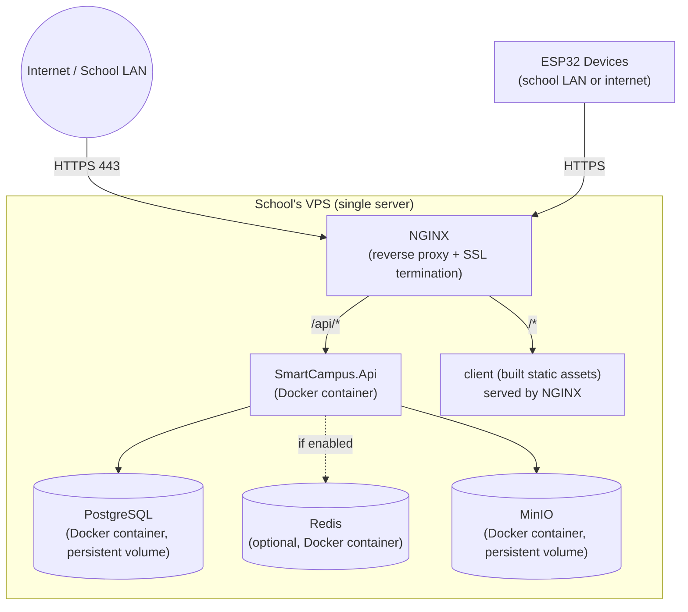

# Deployment Architecture

One school = one VPS = one Docker Compose stack. No shared infrastructure between schools, no orchestration platform — deliberately, per the business model in `README.md` and the "no Kubernetes" stance in `ARCHITECTURE.md` §6.

## Topology (per school)



**Why single-VPS:** matches "if one school goes offline, all other schools continue operating normally" exactly — there is no shared component whose failure cascades across clients. It also means the ops/maintenance mental model is identical for every deployment: one server, one compose file, one set of logs.

## Docker Compose services

| Service | Image basis | Notes |
|---|---|---|
| `api` | Custom (multi-stage .NET build) | Runs `SmartCampus.Api`, connects to `postgres` and (optionally) `redis`/`minio` by container name on the Compose network |
| `postgres` | `postgres:16` | Named volume for data directory; nightly `pg_dump` via a sidecar cron container or host cron (see Backup below) |
| `redis` | `redis:7` | Only included in `docker-compose.yml` if that school's `.env` enables it (`CACHE_PROVIDER=redis`) — otherwise the service block is omitted entirely for that deployment, not just unused |
| `minio` | `minio/minio` | Named volume for object storage (student photos, document uploads) |
| `nginx` | `nginx:alpine` | Reverse proxy, serves built React static assets directly, proxies `/api/*` and `/hubs/*` to `api` |
| `certbot` | `certbot/certbot` | Run periodically (host cron or a scheduled one-shot container) to renew Let's Encrypt certs; NGINX reloaded on renewal |

The React `client` is **not** a running container — it's built (`npm run build`) during the deploy step and its static output is copied into the volume NGINX serves from. One less long-running process per school.

## Environment configuration

All school-specific values flow through a single `.env` file at the VPS, consumed by `docker-compose.yml` and passed into the `api` container as environment variables, which bind to the strongly-typed `SchoolSettings`/`BrandingSettings`/`IotSettings` (Rule #3):

```
# .env (per school, never committed)
SCHOOL_NAME=...
BRANDING_LOGO_URL=...
BRANDING_PRIMARY_COLOR=...
SCHOOL_TIMEZONE=...
DB_CONNECTION_STRING=...
JWT_SIGNING_KEY=...
SMTP_HOST=... / SMTP_USER=... / SMTP_PASSWORD=...
CACHE_PROVIDER=none|redis
MINIO_ENDPOINT=... / MINIO_ACCESS_KEY=... / MINIO_SECRET_KEY=...
ATTENDANCE_LATE_THRESHOLD_MINUTES=...
```

`deploy/.env.example` in the template documents every key with a comment; the clone-and-deploy checklist (`PLAN.md` Phase 6) requires every key to be explicitly set before first deploy — no silent defaults for security-sensitive values (JWT key, DB credentials).

## SSL

Let's Encrypt via Certbot, one certificate per school's domain, renewed automatically. NGINX config template in `deploy/nginx/` is parameterized by the school's domain name (substituted during the rename/clone step), not hardcoded.

## Backup strategy

- **Database:** nightly `pg_dump` to a local file on the VPS, rotated (e.g. keep 14 daily + 6 monthly), additionally shipped off-box to the agency's backup storage (e.g. a shared S3/MinIO bucket used only for backup egress, not runtime — this is the one intentional exception to "nothing shared at runtime," since it's a batch job, not a live dependency).
- **MinIO volume:** included in the same off-box backup rotation.
- **Restore procedure:** documented step-by-step in `deploy/` (stop `api`, restore `pg_dump`, restart) and tested against a throwaway clone before first production deployment (`PLAN.md` Phase 6 exit criteria).

## Deploy process

1. `git pull` the school's repo on the VPS (or a CI-driven `docker compose pull` if images are built in CI and pushed to a private registry — see `CICD.md`).
2. `docker compose build` (or `pull`) + `docker compose up -d`.
3. `dotnet ef database update` runs as a startup step inside the `api` container (migrations applied automatically on boot) — chosen over a separate manual migration step because each school has exactly one environment (no staging/prod split to sequence around), so automatic-on-boot is simpler and safe.
4. NGINX reload if config changed.

## What's explicitly not here

- No blue-green or canary deployment — a single-school, low-traffic admin tool tolerates a few seconds of downtime during a deploy (typically done outside school hours); the operational complexity of zero-downtime deploys isn't justified.
- No CDN — static assets are small and served directly by NGINX; a school's user base is local/regional, not globally distributed.
- No auto-scaling — fixed VPS sizing per school, resized manually if a specific school's usage grows (rare, given the user counts involved).
