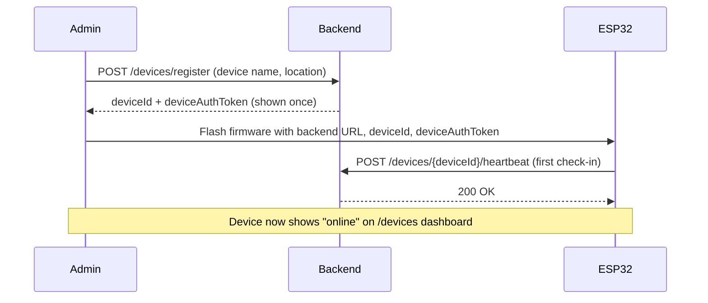
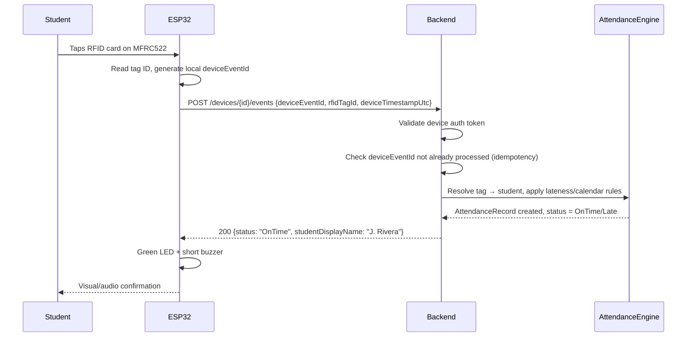
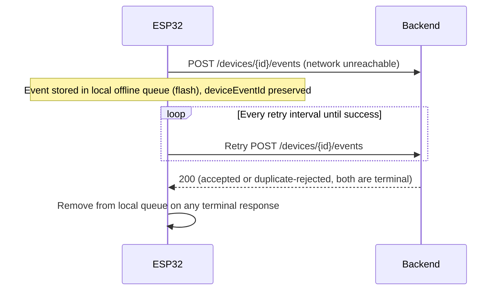
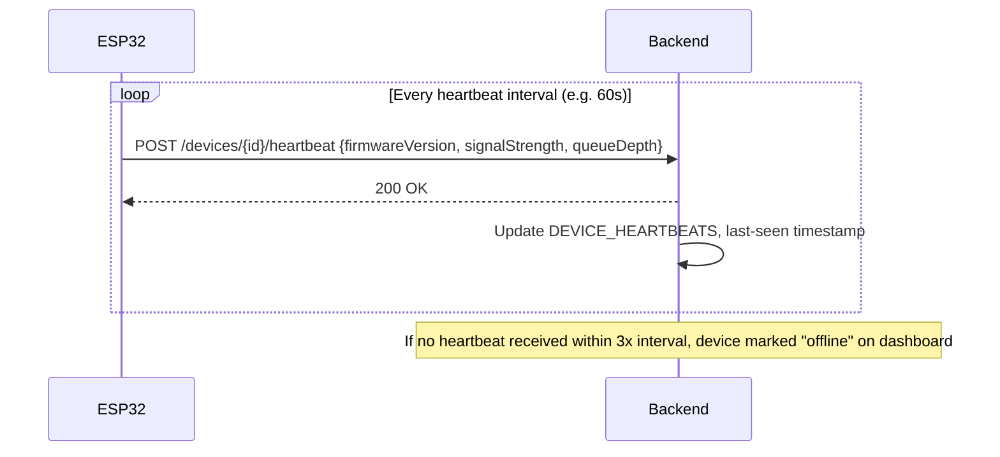

# IoT Communication

ESP32 + MFRC522 RFID reader devices communicate with the backend over HTTPS (REST, per `API_SPECIFICATION.md`). No MQTT broker, no dedicated IoT gateway — a plain authenticated HTTP call per event is sufficient at single-school scale (tens of devices, not thousands) and avoids standing up infrastructure per Rule #8.

## Device lifecycle

The auth token is generated server-side and shown once during registration (like an API key) — it's flashed into firmware, not derived from anything guessable, and can be revoked/rotated by deactivating the device record without needing physical device access.

## RFID scan → attendance event (happy path)

**Key point:** the ESP32 never decides "on time" vs "late" — it only renders whatever `status` the backend returns. This is Rule #4 made concrete: the lateness threshold, calendar exceptions, and duplicate-scan debounce all live in `AttendanceEngine` (backend), not in firmware, so a policy change ships as a backend deploy, not a re-flash of every device in the building.

## Offline queue & retry

Because the server dedupes on `deviceEventId`, a retried event that actually succeeded just before a dropped response is safely recognized as a duplicate — the ESP32 doesn't need to distinguish "did that actually go through" from "did the request fail," it just retries until it gets a terminal (non-timeout) response.

**Queue bounds:** firmware caps the offline queue (e.g. last N events) and reports current `queueDepth` on every heartbeat, so a device that's been offline for an extended period surfaces on the `/devices` dashboard before its queue silently overflows.

## Heartbeat

Heartbeat is the mechanism behind the `/devices` dashboard's online/offline indicator (Section 4/Phase 4 of `PLAN.md`) and the basis for a future alerting rule (see `MONITORING.md`).

## Firmware responsibilities (recap, enforced by Rule #4)

| In scope for firmware | Out of scope (backend only) |
|---|---|
| Read RFID tag via MFRC522 | Deciding late/on-time/absent |
| Generate idempotent `deviceEventId` | Deduplication logic (server enforces via unique constraint) |
| Queue events offline, retry with backoff | Business rules for calendar exceptions |
| Send heartbeat + firmware version | Alerting/notification decisions |
| LED/buzzer feedback based on server response | Any decision about *what* feedback to give |
| Device auth token storage/use | Issuing or rotating tokens (done server-side by an admin) |

## Security notes

- All device communication is over HTTPS (the school's existing NGINX/SSL termination — no separate cert infrastructure for IoT).
- Device auth token is a bearer credential scoped to that one device only — compromise of one device does not expose others' tokens or admin credentials.
- Rate limiting applies to the ingestion endpoints (Rule #5) to bound the damage of a malfunctioning or compromised device flooding requests.
- Firmware version is reported on every heartbeat so a fleet-wide vulnerable-firmware audit is a single dashboard query, not a walk around the building.
